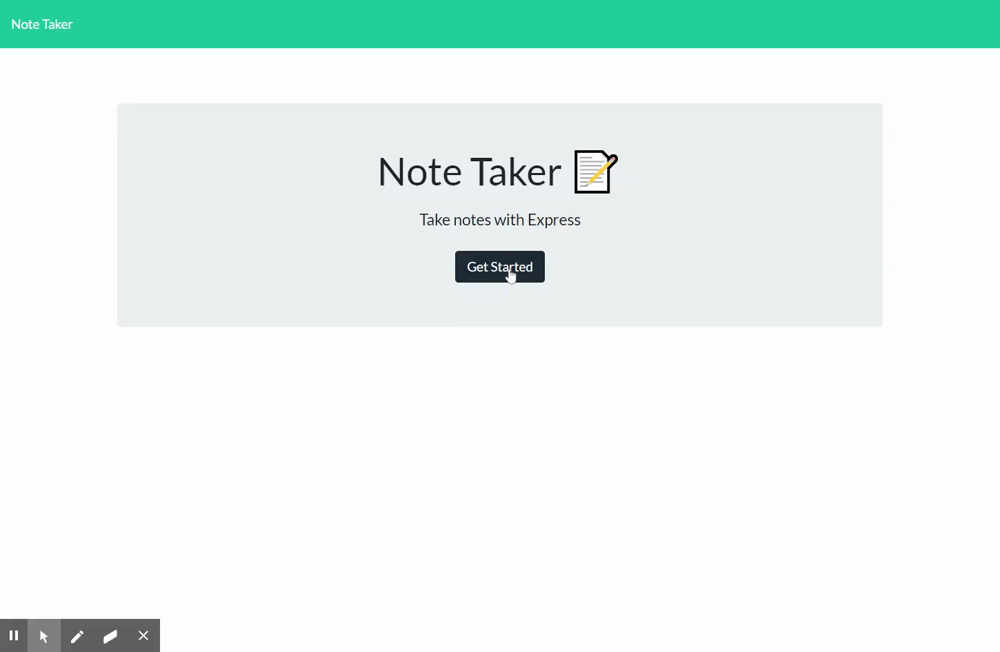

# ExpressNote 

## Description

Sometimes, inspiration strikes. Whether you're in the middle of a meeting, boarding a flight, or otherwise without the means to jot something down, it's important to bottle that lightning before it's gone. Light on its feet and as persistant as a Post-It note, ExpressNote is designed to be there for you when you have to capture that once-and-gone idea, then remember it for later. Whether it's inpsiration for your next project, or just something you need at the grocery store, ExpressNote's easy interface and responsive, Express-powered server backend make sure it's there when you need it.

[Deployed App](https://shrouded-island-51044.herokuapp.com/)

## Table of Contents

- [Installation](#installation)
- [Usage](#usage)
- [Credits](#credits)
- [Contributing](#contributing)
- [Questions](#questions)
- [Tests](#tests)
- [License](#license)

## Installation

ExpressNote is available for download and deployment to a home server or company intranet.

## Usage

Once ExpressNote is deployed, navigate to its home page, click "get started," and get to note taking!

## Credits

I would like to thank first and foremost my Instructor and TAs at the Columbia Engineering Coding Bootcamp for their guidance, instruction, and troubleshooting. Without them, this project wouldn't exist. A massive thank you is due to my study group for their continued feedback, review, and encouragement. We truly have got this!

## Contributing

Contributions to this project are governed by the Contributor Covenent, [and can be read here](https://www.contributor-covenant.org).

## Questions?

Questions about this project can be directed to:

- Github: /puentebravo
- Email: puentematos@gmail.com

## Tests

No tests have been written for this application.

## License

Content in this project is governed under the MIT License.

To read the license in its entirety, click here: [MIT](./LICENSE)

---

Copyright [2021] [Charlie Puente]
